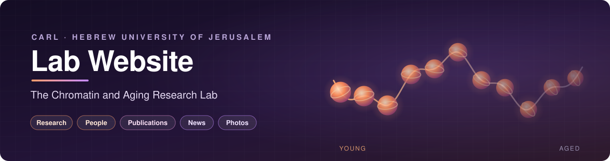
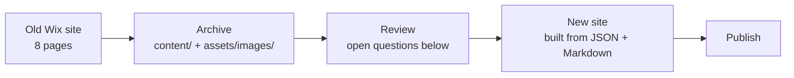

<p align="center">
  
</p>

<p align="center">
  
  
  
  
  
</p>

<p align="center">
  <a href="#overview">Overview</a> ·
  <a href="#whats-archived">What's archived</a> ·
  <a href="#repository-layout">Layout</a> ·
  <a href="#using-the-content">Using the content</a> ·
  <a href="#before-the-redesign">Before the redesign</a> ·
  <a href="#roadmap">Roadmap</a>
</p>

<p align="center">
  <b>Source files for the website of the Chromatin and Aging Research Lab (CARL), led by Dr Michael Klutstein at the Hebrew University of Jerusalem.</b>
</p>

---

## Overview

The lab's current site runs on Wix at [mikeklut.wixsite.com/carl](https://mikeklut.wixsite.com/carl). Before rebuilding it, **everything on the old site was archived here**: every page's text, the menu and footer, contact details, the full publication list, and every image at its original resolution with a caption.

The archive covers all **8 pages in the old site's sitemap**, including two pages that were live but never linked from the menu (`/news` and `/our-research`). The captured content was checked line by line against the live pages. All text is present except two deliberate omissions, which are listed in [`content/README.md`](content/README.md).

> [!NOTE]
> This repository does not contain the new website yet. It holds the **source material** the redesign will be built from, so nothing from the old site gets lost in the move.

## What's archived

| Page on old site | In old menu | Saved as | Contents |
|---|:---:|---|---|
| 🏠 Home | ✅ | [`content/home.md`](content/home.md) | Lab introduction · 9 images |
| 🧬 Projects | ✅ | [`content/projects.md`](content/projects.md) | 3 research projects · 3 images |
| 🔬 Our Research | ❌ | [`content/our-research.md`](content/our-research.md) | Chromatin and heterochromatin background · 3 images |
| 👥 People | ✅ | [`content/people.json`](content/people.json) | PI, lab manager, 4 PhD and 5 MSc students (+ 2 placeholders) · 12 portraits |
| 📄 Publications | ✅ | [`content/publications.json`](content/publications.json) | 22 papers (2016–2025) + 5 press items · 22 thumbnails |
| 📰 News | ❌ | [`content/news.json`](content/news.json) | 4 posts (2017–2018) · 3 images |
| 📸 Lab Photos | ✅ | [`assets/images/lab-photos/`](assets/images/lab-photos) | 15 gallery photos with captions |
| ✉️ Contact | ✅ | [`content/contact.md`](content/contact.md) | Address, phones, emails, contact-form fields |
| 🧭 Every page | — | [`content/site.json`](content/site.json) | Site title, meta description, menu, header logos, footer |

Every image has an entry in [`assets/images/README.md`](assets/images/README.md) (a readable table) and [`assets/images/manifest.json`](assets/images/manifest.json) (machine-readable). Each entry records what the image shows, the person or paper it belongs to, its original pixel size, where it appeared on the old site and the link it pointed to.

## Repository layout

```text
website/
├── README.md                  ← you are here
├── assets/
│   ├── banner.svg             ← README banner
│   └── images/                ← 70 full-resolution images from the old site (~16 MB)
│       ├── README.md            caption table for every image
│       ├── manifest.json        same data as JSON (Wix ID, source URL, size, usages, link)
│       ├── logos/               Hebrew University · Faculty of Dental Medicine · Institute of Dental Sciences
│       ├── people/              portraits, named after the person (michael-klutstein.jpg, …)
│       ├── home/  projects/  research/
│       ├── publications/        thumbnails, named <year>-<first-author>-<title>
│       ├── news/
│       └── lab-photos/          gallery, named after each caption
└── content/                   ← all page text, as Markdown (prose) or JSON (lists)
    ├── README.md                what's saved, the check results, open questions
    ├── site.json                title, menu, logos, footer
    ├── home.md  projects.md  our-research.md  contact.md
    ├── people.json
    ├── publications.json
    └── news.json
```

## Using the content

Structured data lives in JSON so the new site can generate its pages from it, and the photo paths already point into `assets/images/`.

<details>
<summary><b>Example: one entry from <code>people.json</code></b></summary>

```json
{
  "name": "Michael Klutstein",
  "position": "Principal investigator",
  "email": "michaelk@ekmd.huji.ac.il",
  "photo": "assets/images/people/michael-klutstein.jpg"
}
```
</details>

<details>
<summary><b>Example: one entry from <code>publications.json</code></b></summary>

```json
{
  "type": "paper",
  "title": "The effect of chronic inflammation on female fertility",
  "citation": "Ameho and Klutstein, Reproduction 2025",
  "year": 2025,
  "link": "https://rep.bioscientifica.com/view/journals/rep/169/4/REP-24-0197.xml",
  "thumbnail": "assets/images/publications/2025-ameho-the-effect-of-chronic-inflammation.jpg"
}
```

`type` is either `paper` or `media` (press coverage such as BBC, Ynet or the Times of Israel).
</details>



## Before the redesign

These came up while archiving and need a decision from the lab. More detail is in [`content/README.md`](content/README.md).

- [ ] **People:** two placeholder entries ("A", PhD and "B", MSc) share a stock photo. Fill them in or remove them.
- [ ] **Portraits:** five photos are under 120 px wide (Eli, Ayelet, Shir, Reuven, Uri). Collect new ones.
- [ ] **Publications:**
  - The two oldest papers (PNAS 2017, Cancer Research 2016) have no link.
  - The "Evolton" item actually links to a PLOS Biology paper; confirm what it should say.
  - A few 2023 and 2024 items are out of order.
- [ ] **News:** the last post is from 2018. Update News or drop the page.
- [ ] **Footer:** it still says "© 2017".
- [ ] **Contact email:** the contact page lists both a Gmail and a university address. Decide which to show.

> [!IMPORTANT]
> **Image rights.** Some images from the old site are stock photos, journal figures or other organisations' logos, and are marked ⚠️ in [`assets/images/README.md`](assets/images/README.md). Check the licence of each, or replace it, before the new site goes public.

## Roadmap

1. ✅ Archive all text and images from the old Wix site
2. ⬜ Resolve the open questions above
3. ⬜ Choose a stack and hosting, for example a static site on GitHub Pages
4. ⬜ Build the new site from `content/` and `assets/images/`
5. ⬜ Point the lab's link or domain at the new site and retire the Wix site

---

<p align="center">
  <sub>Maintained by CARL · The Hebrew University of Jerusalem · Contributions and issues welcome</sub>
</p>
